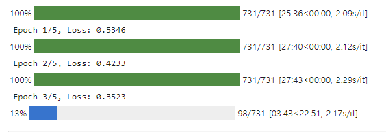
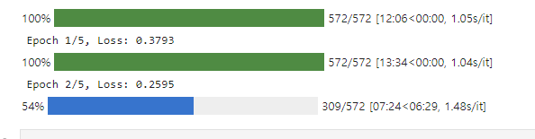

# Pytorch를 사용하여 Multi-GPU 학습하기

최근 LLM 모델을 fine-tuning하기 위해 transformer 모델을 기반으로 한 큰 모델들을 fine-tuning 해보고 있다.

hugging face 에서 제공하는 BertForSequenceClassification 모델로 영화 긍부정 댓글 분류 학습을 하다가 학습이 몇 일씩 걸리는 문제가 발생했다. 다행히 연구실 서버컴에 NVIDIA TITAN 2대가 연결되어 있어 Multi-GPU 학습하는 방법에 대해 공부하고 적용해볼 수 있었다.

torch의 DataParallel을 사용하여 모델, input, labels를 각 gpu에 분산하여 할당했고 학습 시간을 크게 감소시킬 수 있다.
(위 그림에서 27분 -> 13분)

모델을 분산시키니 VRAM이 더 남아 batch_size도 늘릴 수 있다.